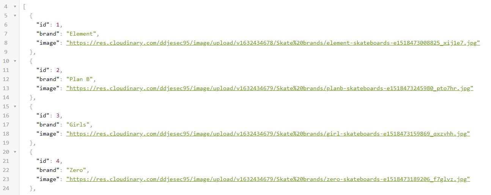

# LETS SKATE SHOP

LETS SKATE SHOP is an app where you can schedule an skate to test it. This repository is the API created in Ruby on Rails that manage the data for a fron end app made in React. 
This API is using PostgreSQL as a database and it's deployed on Heroku.

You can take a look to the [Front-end Repository here](https://github.com/BrianSammit/book_appointment_react)

## Screenshot



## API

<a href="https://skate-store-api.herokuapp.com">Check the API data here</a>

## Built With

- Ruby 3.0.2
- Ruby on Rails  6.1.4.1
- PostgreSQL
- Rspec

### API Documentation

You don't need an API key to access the data. So you can use this API.


**Allowed HTTPS requests:**

- POST: To update resource
- GET: Get a resource or list of resources
- DELETE: To delete a resource

**Description Of Usual Service Responses:**

- 200 OK - the request was successful
- 204 No Content - the request was successful but there is no representation to return
- 400 Bad Request - the request could not be understood or was missing required parameters
- 401 Unauthorized - authentication failed or user doesn't have permissions for requested operation
- 403 Forbidden - access denied
- 404 Not Found - resource was not found
- 405 Method Not Allowed - requested method is not supported for resource.

**Endpoints:**

| Method | Endpoint | Functionality |
|:------:|:--------:|:-------------:|
|POST    |/sessions|Create a current session|
|POST    |/registrations|Create users|
|DELETE    |/logout|Delete the session|
|GET     |/logged_in|To logged in|
|GET     |/skateboards| Get all skateboards|
|GET  |/skateboards/${skateboard_id}| Get a single skateboard|
|GET     |/appointments      |Get all appointments|

### Setup

To run this project locally, please ensure you have Ruby and Ruby on Rails installed on your machine, then clone this repository by running.

```bash
git clone https://github.com/BrianSammit/book_appointment_api.git
```
Open your terminal and CD to the directory where you clone the repository.

Now run:

```bash
bundle install
```

To setup the database run:

```bash
rails db:create
rails db:migrate
```
It's super important to populate the app, so now run:

```bash
rails db:seed
```
To set up the server put:
```bash
rails s -p 3001
```
After this you can open your favorite web-browser and copy paste the next:

```bash
http://localhost:3001
```

### Tests

To check the tests, just run:

```bash
rspec
```


## Author

👤 **Brian Cruz**

- Github: [@githubhandle](https://github.com/BrianSammit)
- Twitter: [@twitterhandle](https://twitter.com/cruzsammit)
- Linkedin: [linkedin](https://www.linkedin.com/in/brian-sammit-cruz-rodriguez-5877551a8/)

## Contributing

Contributions, issues, and feature requests are welcome!

Feel free to check the [issues page](https://github.com/BrianSammit/React_bookstore/issues).

## Show your support

Give a ⭐️ if you like this project!

## Acknowledgments

- The Odin Project
- Microverse

## License

This project is MIT licensed.!
